# Comprehensive Hospital Outcome Prediction System (CHOP)
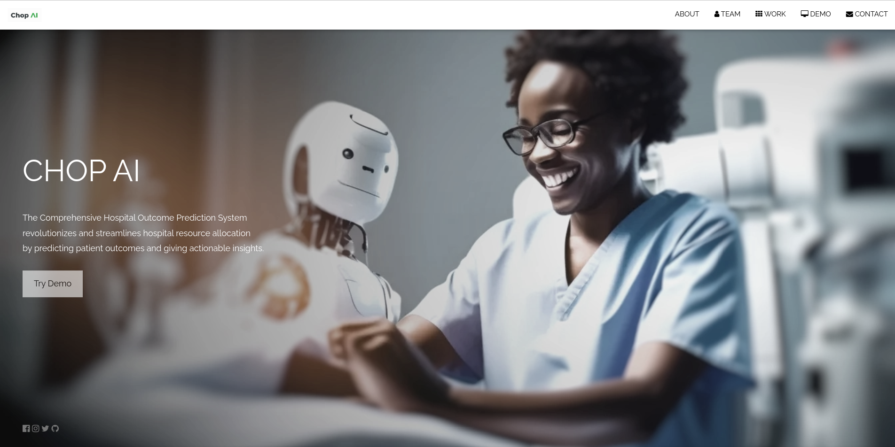
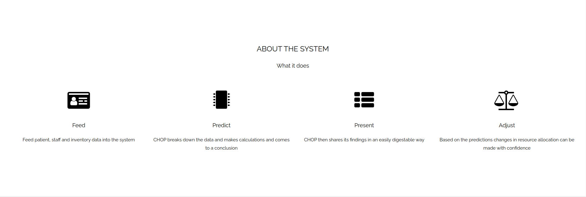
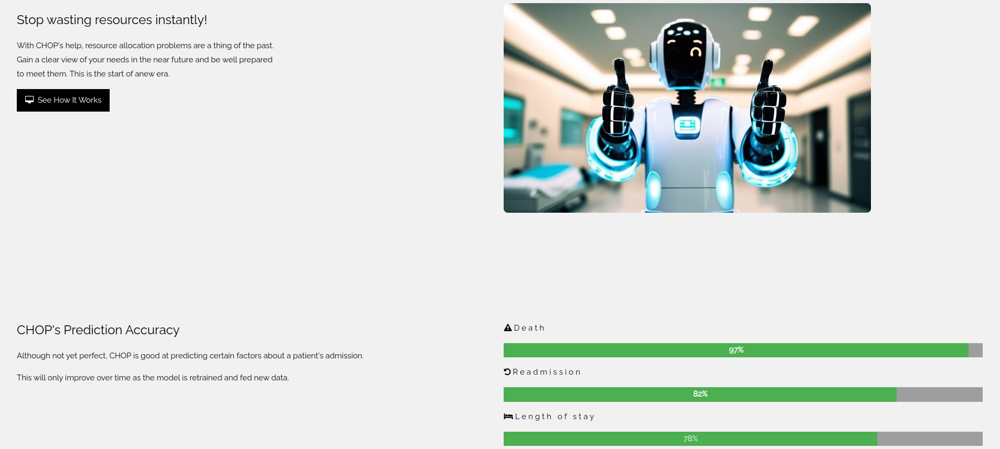
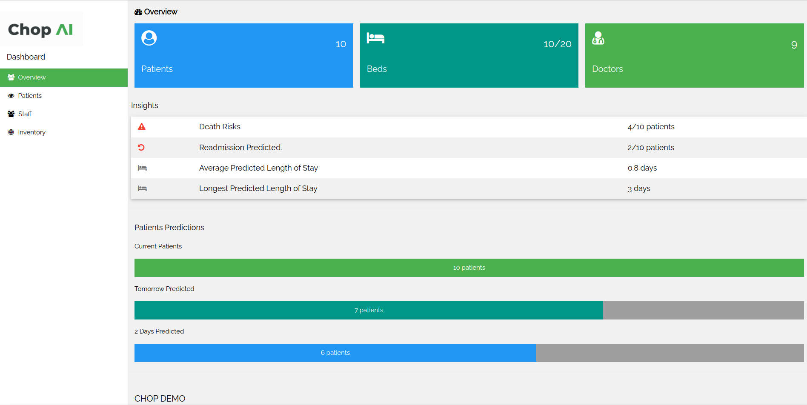
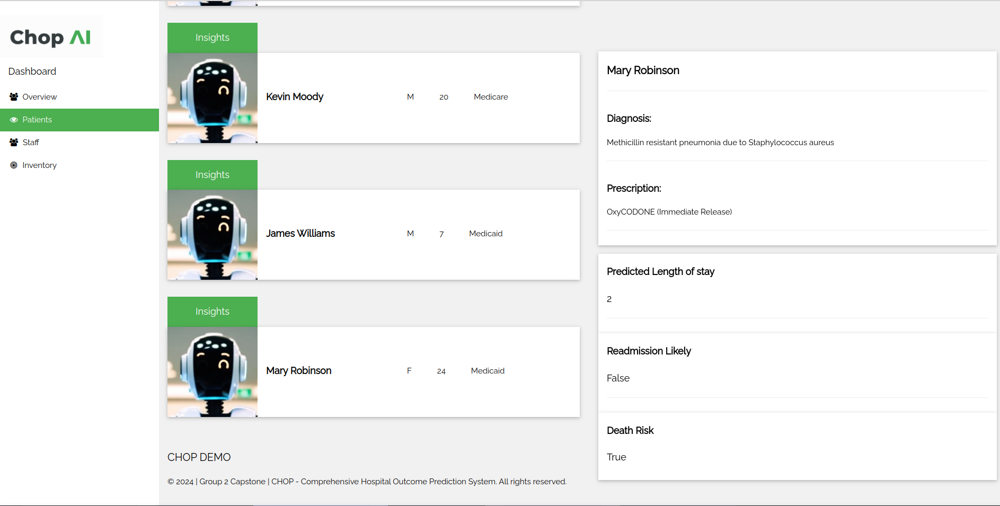

**PITCH**

In the medical sphere, predicting and allocating resources needed is a difficult task that can end up in a lot of wasted resources. It is our vision that armed with the right information, a hospital can better plan and allocate its resources. When a patient is admitted, extra insight into the patient's future stay is already available and the hospital can plan accordingly.

**Technologies Used**
- Python
- Pandas
- Scikit-learn
- Numpy
- Seaborn
- Matplotlib
- FastAPI
- Uvicorn
- W3 HTML Elements

## Business Understanding

**Overview**

The CHOP Model aims to predict patient outcomes and optimize resource allocation in healthcare settings. By providing accurate predictions regarding patient stays, CHOP  will serve as a decision-support tool for healthcare administrators.

**Problem Statement**

Hospitals struggle to accurately forecast patient recovery times, potential complications, and necessary resources such as staff and beds. This uncertainty can result in either ***over-preparation*** 
(wasted resources), or **under-preparation**(poor service).

**Proposed Solution**

Our solution is to develop a model that given patient information, can predict aspects of their stay including duration and cost. By having a better picture of patient needs, the hospital can more efficiently plan for allocation of resources such as beds and staff.

The system will be able to monitor inpatient numbers to flag if available resources will meet demand in the near future. As an example, with projected number of patients in the coming days, if the system finds that staff on duty on a specific date falls short of demand, it will make this known to administrators.

---

**Objectives**

- **Dummy Hospital:** A fake hospital complete with room, patient and staff records will be created.

- **Data preparation:** The data is split into dozens of CSV files. Information in the relevant files will be extracted and joined in a way that is usable for model training.

- **Develop a Predictive Model:** Create a model capable of accurately predicting patient outcomes, including recovery time and likelihood of complications after the doctor has logged their diagnosis in the system.

- ***Model Accuracy:*** 80% has been set as the baseline for a successful model.

- **Hospital Management System:** A hospital management suite will be created featuring patient and staff management.

- **Deploy Model:** The model will be deployed to the management software.

- **Optimize Resource Allocation:** Use the model’s predictions to optimize the allocation of hospital resources, such as staff, equipment, and beds, ensuring they are used efficiently and effectively.

**Metrics of Success**

1. **Model Accuracy**: Achieving high accuracy in predicting patient outcomes is imperative.
2. **Compliance and Security**: Adherence to ethical standards and data privacy regulations.
3. **User Acceptance**: Positive feedback from hospital administration regarding the model's usability and insights.

**Challenges**

- **Data Availability and Quality:** Obtaining comprehensive, high-quality patient data that covers a wide range of variables is essential.

- **Complexity of Healthcare Data:** Medical data is complex. It includes medical records, lab results, and physician notes among others. Cleaning the data into a usable format will be a big undertaking.

- **Privacy and Security Concerns:** Handling sensitive patient data requires strict adherence to privacy regulations.

## Data Understanding

**Data Sources**

The **MIMIC-IV** Clinical Database provides comprehensive clinical information on patients admitted to Beth Israel Deaconess Medical Center. The database contains de-identified patient data in compliance with HIPAA standards. Several subsets of the data have been pinpointed for use.

This dataset is a relational database where each table ha been stored as a CSV.

**Relevance of Data** 

The selected datasets collectively provide a holistic view of patient information, covering demographics, clinical diagnoses, lab results, and treatment services.

**Methodology**
Data Collection: Historical patient data was collected and stored for analysis.
Data Preprocessing: The data was cleaned, missing values were handled, and features were engineered to improve model performance.
Exploratory Data Analysis (EDA): Visualizations were created to understand the data distribution and correlations.
Model Development: Various machine learning models were developed, including Logistic Regression, Random Forest, and XGBoost.
Model Evaluation: The models were evaluated using accuracy, precision, recall, and F1 score to select the best-performing model.

## EDA 
**Data Visualization**

**Univariate Analysis**

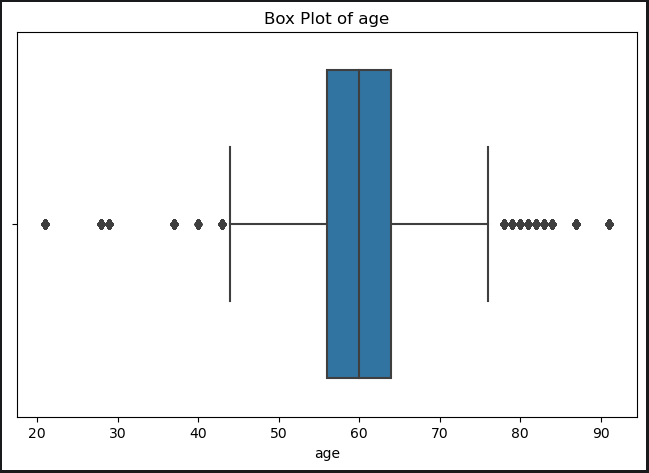
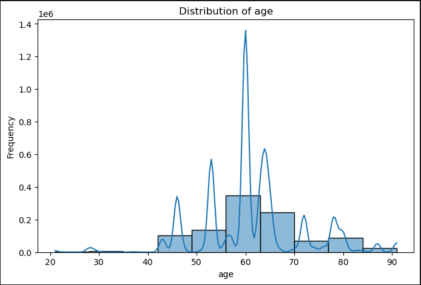
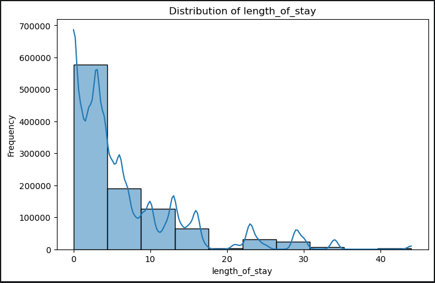
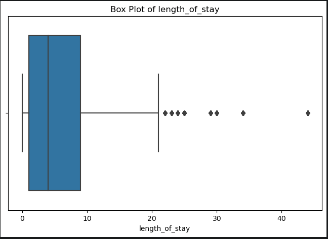

**Bivariate Analysis**

**Time Series**
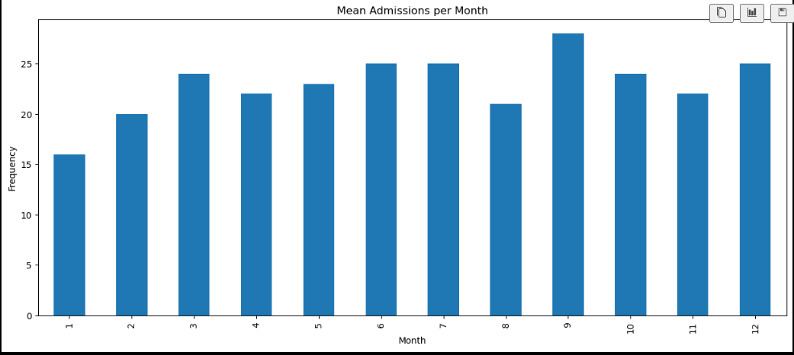
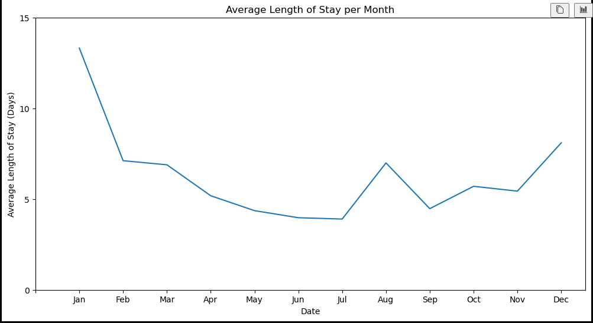
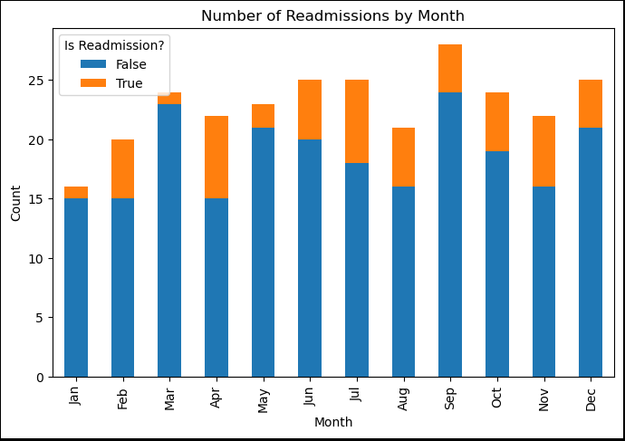

## Models

**Length of stay**:
A random Forest Regression Model perfeomed the best in modeling by explaining 78% of the variance in the target variable.
~~~
Mean Absolute Error (MAE): 0.23
Mean Squared Error (MSE): 0.23
Root Mean Squared Error (RMSE): 0.48
R-squared (R²): 0.78
Median Absolute Error: 0.00
Explained Variance Score: 0.78
~~~

**Death**:
Predictiong the death wound up  straight forward as the first model attempted performed very well. A logistic Regression Model with 98% accuracy was created.
~~~
Accuracy: 0.98535
              precision    recall  f1-score   support

           0       0.99      0.99      0.99     18599
           1       0.89      0.90      0.90      1401

    accuracy                           0.99     20000
   macro avg       0.94      0.94      0.94     20000
weighted avg       0.99      0.99      0.99     20000

~~~

**Readmissions**:
For readmission a Random Forest Classifier with 84% accuracy was trained.
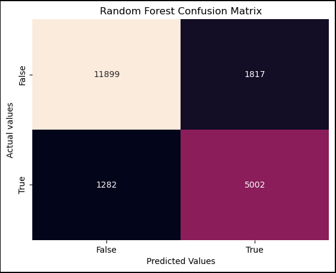

### Results
The CHOP Model was able to predict patient outcomes with a high degree of accuracy. The model's predictions were validated against a test dataset, and the results were consistent with the expected outcomes.

## Conclusion
The CHOP Model demonstrates the potential for machine learning in healthcare to improve patient outcomes and optimize resource allocation. By leveraging historical data, the model provides actionable insights that can assist healthcare providers in making informed decisions.

In using the demo dashboard it's easy to see how useful it would be to hospital administrators and the sky is the limit as to what metrics the system can monitor and provide insight on.

## Future Work
Model Refinement: Further tuning and testing with more diverse datasets to improve accuracy.
Integration: Implementing the model into hospital management systems for real-time predictions.
Expanding Features: Including additional features such as patient lifestyle factors to improve prediction accuracy.

